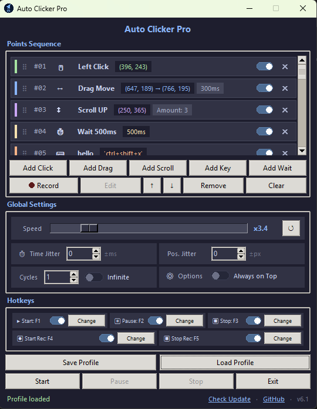

# Auto Clicker Pro (v6.1) 🚀

Auto Clicker Pro is a highly sophisticated, modular, and human-like automation utility designed to simulate complex mouse and keyboard sequences through a user-friendly, dark-themed interface based on the popular **Catppuccin** color palette. 


In version **v6.1**, the application introduces an interactive **Action Cards UI**, fluent **Pill-shaped Toggle Switches**, **Per-Action Muting**, and a silky-smooth **Live Drag & Drop Engine**. Built upon a decoupled **Composition-based Architecture** with centralized theming, structured rotating file logging, and automated unit testing, Auto Clicker Pro offers an unparalleled macro automation experience.

---

## Features

- **Modern Action Cards Sequence View** — visual sequence cards with color-coded parameter badges, action icons, and inline controls
- **Per-Action Muting** — toggle individual actions on/off with a single switch without deleting them from your sequence
- **Smooth Drag & Drop Reordering** — drag sequence cards with real-time feedback, midpoint hysteresis, and zero jitter
- **Click, Drag, Scroll, Keyboard & Wait** actions in one unified sequence
- **Multi-Button Click Capture** — automatic detection of Left, Right, and Middle clicks on screen
- **Record** real mouse + keyboard actions and convert them into editable points
- **Pause / Resume** — stop mid-sequence, edit the list freely, then continue
- **Speed control** (×0.1 – ×20) with live scaling of all delays, holds and drags
- **Hotkeys** for Start / Pause / Stop / Start Recording / Stop Recording (fully customizable, each with a toggle switch)
- **Time Jitter** (±ms) and **Position Jitter** (±px) for human-like behavior
- **Cycles** + Infinite mode
- **Save / Load** profiles (JSON) with full backward compatibility
- **Copy / Cut / Paste** items (`Ctrl+C` / `Ctrl+X` / `Ctrl+V`)
- **Live position preview** when editing — drag the on-screen marker to reposition
- Optional **custom name** for every action type
- **Color-coded + emoji badges** for instant recognition of action parameters
- **Tooltips** on controls and smart ellipsis truncation for long text inputs
- Clickable **GitHub** link in the app footer
- **Check Update** — checks GitHub Releases for newer versions
- Always-on-top option
- Clean dark theme (Catppuccin-inspired)


## Screenshots


---

## 🚀 Getting Started

### Prerequisites
*   Python **3.8 or higher**
*   Windows, macOS, or Linux operating system (Keyboard layout switching is optimized for Windows)

### 1. Installation
The application relies on the `pynput` library for system-wide keyboard and mouse capturing/simulation. Install it via pip:
```bash
pip install pynput
```

### 2. Run the Application
Simply execute the main launcher script:
```bash
python main.py
```

---

## Usage Guide

### Adding Actions
| Button          | Description                                                                 |
|-----------------|-----------------------------------------------------------------------------|
| **Add Click**   | Click on screen (Left, Right, or Middle) → settings popup opens to configure |
| **Add Drag**    | Press & hold, then release → settings popup opens                           |
| **Add Scroll**  | Click on screen to set position → settings popup opens (direction & amount)  |
| **Add Key**     | Type or capture a key / combination (`ctrl+c`, `alt+f4`...), set repeats    |
| **Add Wait**    | Insert a delay (in milliseconds)                                            |
| **Record**      | Record live mouse + keyboard actions                                        |

### Editing & Organizing

*   **Drag & Drop Reordering:** Click and drag any card up or down to reorder the sequence in real time. Midpoint hysteresis ensures smooth, jitter-free positioning.
*   **Per-Action Muting:** Flip the toggle switch on the right side of any card to disable that step without removing it. Muted steps are visually dimmed and automatically skipped during execution.
*   **Quick Delete (`✕`):** Click the red close icon on any card to remove it immediately.
*   **Edit Action:** Double-click any card to open its dedicated configuration popup.
*   **Clipboard Shortcuts:**
    - `Ctrl + C`: Copy selected action.
    - `Ctrl + X`: Cut selected action.
    - `Ctrl + V`: Paste action directly below selection.
    - `Delete`: Remove selected action.

The action cards are **color-coded with emojis & badges**:
| Action | Emoji | Color   | Badges Displayed |
|--------|:-------:|---------|------------------|
| Click  |  🖱️   | Green   | Coordinates `(x, y)`, Hold duration, Repeat count |
| Drag   |  ↔️   | Blue    | Coordinates `(x1, y1) → (x2, y2)`, Hold duration |
| Scroll |  ↕️   | Purple  | Coordinates `(x, y)`, `Amount: <n>`, Repeat count |
| Wait   |  ⏱️   | Yellow  | Delay duration `ms` |
| Key    |  ⌨️   | Orange  | Key `'combo'`, Repeat count |

### Global Settings
**Speed:** Global playback speed from ×0.1 to ×20 (default ×1.0). Affects waits, holds, drag duration, and repeat delays. Can only be changed before Start, while Paused, or after Stop. Use **Reset** to return to ×1.0.  
**Time Jitter:** Add a randomized delay variation of up to `±500ms` on wait actions, preventing rigid, machine-like click intervals.  
**Position Jitter:** Add a random spatial offset of up to `±50px` on your clicks and drag points to simulate natural, non-static human click distributions.  
**Cycles:** How many times the whole sequence should run.  
**Infinite:** Run forever until stopped.  
**Always on Top:** Keep the window above other windows.

### Hotkeys (default)
| Action              | Default Key | Toggle Switch |
|---------------------|:-------------:|:---------------:|
| Start               |    `F1`     |   Enabled       |
| Pause / Resume      |    `F2`     |   Enabled       |
| Stop                |    `F3`     |   Enabled       |
| Start Recording     |    `F4`     |   Enabled       |
| Stop Recording      |    `F5`     |   Enabled       |

You can change any hotkey and enable or disable individual hotkeys with their dedicated toggle switches.  
Media / system keys (volume, play/pause, brightness, etc.) cannot be assigned as hotkeys.


## Profile System

**Save Profile** → exports current sequence + all settings (including speed and mute states) to a `.json` file  
**Load Profile** → restores everything (points, hotkeys, jitter, speed, muted steps, etc.)

Perfect for sharing macros or switching between different tasks.


## Tips

- Use **Record** for complex sequences, then clean them up with Edit.
- Temporarily mute individual actions using their card toggle switches instead of deleting and recreating them.
- For more natural behavior, enable a small Time Jitter and Position Jitter.
- Name each point for better organization in long sequences.
- Drag the on-screen preview marker when editing to reposition points quickly.
- Use **Speed** above ×1 to run macros faster, or below ×1 for careful debugging.
- The app forces English keyboard layout on Windows when focused (helps with key recording).
- Use **Pause** when you need to adjust the sequence mid-run without losing progress.
- Hover over buttons, cards, and controls to see short English tooltips.
- Click **Check Update** in the bottom-right to see if a newer release is available on GitHub.
- Click the **GitHub** link in the bottom-right corner to open the project repository.

---

## ✨ What's New in v6.1

*   **Interactive Action Cards View:** Replaced the legacy flat Listbox with modern, rich Action Cards (`widgets.py`). Each card features an accent color bar, drag grip (`⠿`), index indicator (`#01`), action emoji, title, parameter badge pills, inline enable/mute toggle switch, and instant delete button (`✕`).
*   **Per-Action Muting:** Each sequence card now contains a dedicated toggle switch allowing users to temporarily disable specific actions without removing them from the sequence. Muted cards are visually dimmed and automatically bypassed during playback.
*   **Smooth, Jitter-Free Drag & Drop:** Engineered a live drag-and-drop reordering engine with midpoint hysteresis and stable slot tracking. Completely eliminates flickering, oscillation, and erratic slot hopping. Includes active peach highlights and edge auto-scrolling.
*   **Pill-Shaped Fluent Toggle Switches:** Custom Canvas-based toggle switches (`ToggleSwitch`) featuring smooth pill contours, crisp pure white thumbs with identical ON/OFF dimensions, and harmonious Catppuccin palette integration.
*   **Intuitive Parameter Formatting:** Scroll actions display clean `Amount: <n>` badges (matching popup dialogs) instead of technical `dy:` labels. Keyboard actions feature clean `Key` titles with values exclusively in the badge pill, eliminating redundant text.
*   **Multi-Button Click Capture:** `Add Click` screen listener now automatically distinguishes between Left, Right, and Middle mouse clicks and pre-selects the click type in the configuration modal.
*   **Aligned 2×2 Global Settings Grid:** Uniform 2-column layout (`uniform="g_col"`) guaranteeing exact pixel alignment across all Global Settings controls.

---

## 📂 Modular Project Structure

The project comprises the following organized file structure, coupled cleanly via **Composition**:

| File Name | Technical Responsibility |
| :--- | :--- |
| **`main.py`** | Application coordinator (`AutoClickerApp`). Orchestrates subsystem instances, manages window lifecycle, and wires global events. |
| **`widgets.py`** | Modern custom visual widgets: Canvas-based `ToggleSwitch`, `ActionCard`, `ActionCardsView` with smooth drag-and-drop reordering, and tooltip integrations. |
| **`theme.py`** | Centralized Catppuccin Mocha theme definitions, color constants, and typography. |
| **`logger.py`** | Application logging infrastructure with rotating file handlers and console stream formatting. |
| **`models.py`** | Data models (`ActionPoint`) with type hints, serialization (`to_dict`, `from_dict`), and dictionary compatibility layers. |
| **`actions_engine.py`** | Simulation engine managing multi-threaded playback loops, speed scaling, jitter offsets, action muting checks, and peripheral dispatching. |
| **`recorder_engine.py`** | Real-time event recording engine tracking mouse clicks, drags, scrolls, and keystrokes with noise filtering. |
| **`list_manager.py`** | Point sequence management, drag-and-drop reordering, copy/cut/paste clipboard operations, and card list coordination. |
| **`profiles_manager.py`** | Profile persistence manager handling JSON serialization, validation, and disk I/O. |
| **`hotkey_manager.py`** | Global background keyboard shortcut listener and dynamic re-binding manager. |
| **`updater.py`** | Asynchronous GitHub release checker comparing SemVer tags. |
| **`system_utils.py`** | Platform-specific utilities including Windows keyboard layout enforcement and screen centering. |
| **`gui_layout.py`** | Main window widget layout, ttk styling, tooltips, and state locking manager (`set_ui_lock_state`). |
| **`gui_components.py`** | Reusable UI components including the delayed `ToolTip` and on-screen draggable crosshair preview markers. |
| **`popups.py`** | Modal dialog windows for adding and editing actions with live coordinate capture and preview handles. |
| **`utils.py`** | Resource path resolution for PyInstaller bundles and physical key mapping translations. |
| **`tests/`** | Automated test suite verifying data models, persistence, jitter math, widgets, and popup integration. |

---

## License
This project is licensed under the MIT License.  
Feel free to use, modify and distribute.

## Contributing
Pull requests are welcome!  
If you find a bug or have a feature idea, open an issue.

Made with ❤️ for automation lovers

**Version:** v6.1 | **Theme:** Catppuccin Dark | **Author:** [TamimiAliIR](https://github.com/tamimialiir)
